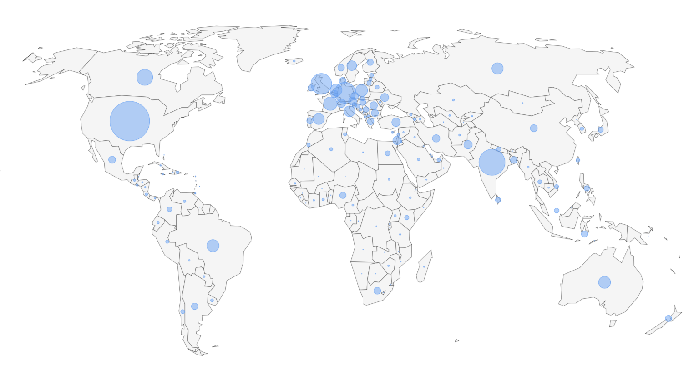
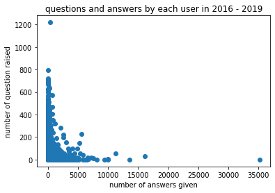
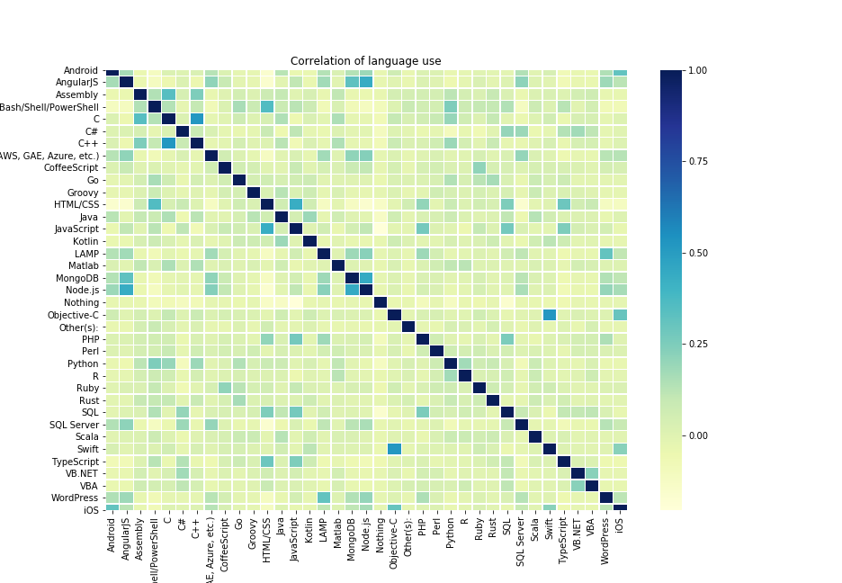

> *The rapid rise of questions & answers site, driven by the past decade’s Internet boom, has brought with it promises of more participatory governance, new online dynamics and a opportunity for users to abosrb and share knowledge across frontier.*  

Stack Overflow is arguably the most popular questions & answers site in the world of programmers as highlighted in the following figure, in which a map visualizing the Stack Overflowers around the globe has resulted in a new outline of the world. As such, this data story focuses on Stack Overflow user community over the world, the various characters of users in different regions and finally the connection and interaction built upon this platform.



## Goal
The main idea of our project is to study the different user communities across the world of Stack Overflow really like and when do they use it? How are they distributed around the world, which country contributes the most to the site, and in which ways? The information could be very interesting to Stack Overflow itself, since it would allow them to understand the users potential areas for growth.

## Dataset
We used the following datasets.
- **Stack Overflow Annual Developper Survey** ([link](https://console.cloud.google.com/marketplace/details/stack-exchange/stack-overflow)): They ask questions like Do you code as a hobby, Are you currently enrolled in a formal, degree-granting college or university program and many other kinds of questions. The respondents were recruited through onsite messaging, blog posts, email lists, meta posts, banner ads, and social media posts. According to the documentation, highly engaged users on Stack Overflow were more likely to notice the links for the survey and click to begin it. The dataset is in CSV format and about 50 - 200MB per year.
- **Stack Overflow Data from Google BigQuery** ([link](https://insights.stackoverflow.com/survey)): The dataset is hosted in Google BigQuery and we get 1TB of free BigQuery processing every month which means we can get 1TB of data per month. There are data of users, posts, comments, tags, votes, and badges from 2008 to 2019. We can use SQL queries to get the data we want and use the download feature to save it as CSV or JSON file. Stack Overflow Annual Developer Survey
- **World Bank Open Data /UN Data/ Kaggle World Bank**: short description

## Interesting Findings
Here are some of the interesting insights. We categorized them into three sections, <span class="user">user</span>, <span class="time">time</span> and <span class="country">country</span> related.

{: .finding-legend }
  - {: .user } Visit frequency is correlated to job satisfaction.
  - {: .user } We are carried by super active stackoverflow users.
  - {: .user } Experience influences user activity.
  - {: .user } The 6 most important programmer archetypes.

  - {: .time } % of question answered per year.
  - {: .time } Weekday vs. Weedend.
  - {: .time } Work hour vs. Free time.

  - {: .country } Asian countries have higher active rate.
  - {: .country } Chinese stackoverflow user mysterious inactiveness.
  - {: .country } Information is flowing between countries.
  - {: .country } Programmer from different countries are different.


### More stackoverflow, better job success?
To get the most basic idea of how do people use Stack Overflow, let's plot the visit frequency distribution of the survey respondents. We see that most people answering the survey use stackoverflow quite often. This may of course be due to the sample being somewhat skewed, since active Stackoverflow users are probably more inclined to answer the survey. 

<iframe class="plotly-plot" src="assets/export/visit_frequency.html"></iframe>

It is interesting to see how does the activity on Stack Overflow correlates with the job satisfaction and average salary of the users. From the following figure, we can see that the job satisfaction increases actually quite clearly with more time spent in Stackoverflow. Maybe it's a good idea to search for the answers instead of trying too hard in solving all problems by yourself.

<iframe class="plotly-plot" src="assets/export/job_satisfaction_salary.html"></iframe>

### Super Contributor of Stack Overflow
When searching for solution on Stack Overflow, have you ever wonder who is providing the answers that you are looking for?

We analyse the number of questions and answers from 2016 to Sep 201 and group them per unique user id.

<iframe class="plotly-plot" src="assets/export/q_a_per_user.html"></iframe>

As we can see both the number of questions and answers given by users of Stack Overflow roughly follows a power law distribution. Although a general user only ask a few questions / provide a few answers, there are some users who contribute largely to the question and answer pool.

There exist one person who ask over 1200 questions in a 4 year period, which is over one question per day. The phenomenon is even more obvious for answer distribution, where there are people who give more than 10000 answers over 4 years (around 6 / 7 answers per day) and one even gives 35219 answers in 4 years (over 24 answers per day!!!). Being only visitors of Stack Overflow, we are definitely "carried" by those big contributors of the community.

### Experience Gap between Individual Users
The number of questions and answers of each respective user from year 2016 to Sep 2019 is isloated out and plot in the graph below.


{: .align-img}

A power-law-like distribution can be observed. This distribution is probably due to the experience difference of users of stackoverflow. For more experienced users, they are more likely to answer questions from others. While for beginners or people first exposed to a new technology / framework, they are more likely to ask questions on the relevant topics, thus resulting in such a shape.

Another point of notice is that the majority of the users does not participate much (the dense blue area near the origin). There are people who contributes a lot but the joint contribution of small contributors are also relevant in creating the large community of stackoverflow that we experience.

### Developer Types from Stackoverflow
What about the professional lives of the users? To get a feel of the different technologies that Stack Overflow users have, the following plot shows the distribution of the language use, showing languages with at least 4000 users in the survey.

<iframe class="plotly-plot" src="assets/export/language_distribution.html"></iframe>

Seems like JavaScript is clearly the most used programming language with 60% of survey responents saying that they are using it. The proportion of users drops quite quickly for the less mainstream languages like Rust and Kotlin.

We thought that it is also interesting to see how are the languages correlated between each other. The figure below shows the correlation matrix between the same languages with at least 4000 users in the survey. Clear patterns emerge, like HTML/CSS being strongly correlated with JavaScript, both vital languages for web development, and Swift with Objective-C, which makes sense since both are used mainly to develop for Apple products.



To take the analysis further, we tried to do soft clustering on the users and their programming language use with non-negative matrix factorization. The idea was to extract automatically programmer “personas”, archetypes to which all programmers can be divided to, with each programmer having a separate score for each persona. The most important features of the personas are plotted in the following figure (with logarithmic axes, hover mouse over to see the actual values), where we can see the scores for how much is each programming language associated with each type. The types are actually quite possible to interpret intuitively, and we decided to label them as “Frontend Web”, “Python/Scripting”, “C#/General purpose”, “Java/App development”, “Backend Web” and “Low-level”.

<iframe class="plotly-plot stretch" src="assets/export/programmer_types.html"></iframe>

We will come back to these "developer personas" in the third section, where we do a geographical analysis of their distribution, so keep them in mind.


### Yearly Participation
Response rate to questions can be analysed in a yearly basis. 

<iframe class="plotly-plot" src="assets/export/questions_answered_per_year.html"></iframe>

It is interesting to see that even when the stackoverflow community seems very powerful and 'knows' everything, there are still a noticable portion of around 15-20% of the questions posted on stackoverflow each year which does not receive any answers. They remain unnoticed in the sea of questions. The portion of questions receiving no answers is also increasing in 2016 to 2018 (2019 data is not accurate as the full year data is not available by the time of the plot). 

Noticably, it is also rare for a single question to receive more than two answers, given there could often be multiple ways to achieve the same output.

### Working Days
To get a feel of how the activity of the site evolves on a weekly basis, the plot below shows an example time period showing the amount of questions asked per day on Stackoverflow. Zoom by selecting an area of the plot to see more closely. We can see a pattern where the amount of questions decreases to almost half during the weekends and rises back again during working days quite reliably. It's also interesting to note that the amount of questions asked also drops to even lower amounts once a year during Christmas and New Year's eve. No other seasonal event can be seen as clearly.

<iframe class="plotly-plot stretch" src="assets/export/questions_per_day.html"></iframe>

### Working Hours
Another way to view the activity is to just look within one day. We can calculate the percentage of questions and answers being posted during working hours and free time. We decided to compare this percentage between users from different countries since it can give us an idea of which country's user prefer to use the site during work.

#### Questions
<iframe style="height: 360px;" src="assets/export/working_hour_q.html"></iframe>
#### Answers
<iframe style="height: 290px;" src="assets/export/working_hour_a.html"></iframe>

Note: We filtered out countries with less than 50k questions and 100k answers to focus on active countries. You can change the threshold by clicking the triangle button next to # of Q/A. You can also do ascending sorting by clicking the "percentage" column header.
{: .description }

People from Netherland, France and United Kingdom seems to be the most active during working hours. The percentage of Russian Federation is surprising low. This is becauase the way we decided if it's in the working hours or not was by taking one of the time zone in the country and convert the UTC timestamp in the dataset into local time. Countries like Russia and United States have multiple time zones, which causes our estimation to be inaccurate.


### Mapping StackOverflow Usage in the World
> *On a global level, the USA holds the biggest Stack Overflow user commmunity and Sweden is the top country in terms of  penetration as percentage of the population.*  

<iframe class="plotly-plot stretch" src="assets/export/active_user.html"></iframe>

On a regional level, we can recognize some patterns in terms of users activenss, the  penetration pf StackOverflow penetration and the size of user community. En particular, we observe from the **_Active User Ratio Map_** that users in developping countries tend to have a higher proportion of active user. We think this is due to the **_survivorship bias_**: People in these region have fewer access to PC and high education, and the Stack Overflow users of these regions can be considered as **_Survivor_**. And a **_Survivor group_** tends to have a higher activeness.

On the User Density Map we could clearly recognize some regional patterns for the developpment of IT industry. 
- The well-known Nordic Tech, a powerful innovation engine in Europe
- CANADA — A leader in ARTIFICIAL INTELLIGENCE

On a regional level, countries can be divided into several groups according to their rates of Stack Overflow penetration and the size of user community. Some most distinct regional groups are the following:

1. **The Giants**: USA, India  
These two countries have a particular large number of users and their users provide with a significant contribution to the Question & Answer activities on StackOverflow.

2. **Top Performers**: Scandinavian countries, some Western European countries such as Switzerland, Netherlands along with Canada and Australia  
These countries have showed a very high StackOverflow penetration rates in the survey , indicating a pervasive use of StackOverflow in their groups of programmers.Despite their small countrysize, these countries all together demonstrate a highly efficient and active use of StackOverflow in their countries. 

3. **Emerging Countries**: Mostly asian countries including Bangladesh,Pakistan,Iran etc.  
These countries's StackFlower user penetration rates are below the global average . But we can observe a highly emerging trend from their users' particularly active participation.

Furthermore, we observe that the number of questions and the number of answers of users are not always balanced in an area. More concretely, we find that on local level, the  answer question proportion could be very different from the global average and this phenomenon is very common and seems to follow some geographical pattern. We thus come up with a hypothis that users on StackOverflow could have different preference between ask questions and propose answers and this preference follows a geographic distribution. To carry out further analysis on this topic, we try to visualize the answer distribution and question distribution over a world map. The total number of question or answer doesn't give much sense since they are just expanded by the size of local user commity. We then turn our attention to the geo-distribution of answer&question per user. This time we observed that users in Western Europe like Germany, Austria and Finland are more likely to answer to a question on Stack Overflow.

### Questions and Answering Tendency of Different Country
We can alse see the distribution of the Stack Overflow participation in a country-view.

<iframe class="plotly-plot stretch" src="assets/export/question_answer.html"></iframe>

* **Raw Question / Answer Count ('Questions Per Country' & 'Answers Per Country')** 
The distribution of number of questions and number of answers provided from different country is relatively similar. The areas that provide more overall contribution is more likely to be those with larger user base of stackoverflow, including United States, India and Australia.
    
* **Normalised Question and Answer Count ('Questions Per User Per Country' & 'Answers Per User Per Country')**
However, the graph becomes more interesting when the raw count is normalised with the user number from each country. Smaller countries, like British Virgin Island (cannot be shown in the plot) or Greenland rise up to top. The two graph, 'Questions Per User Per Country' and 'Answers Per User Per Country' shows the relative tendency of contributing questions and answers from people from different country.

* **Experience Gap - Country View ('Ques / Ans Per User Per Country')**
A special scope of analysis can also be applied, as shown in the graph 'Ques / Ans Per User Per Country'. It shows the relative likelihood to ask a question than giving an answer. The higher the positive (log) value, the more likely for people in the country to ask questions on stackoverflow. On the other hand, the lower the negative (log) value, the more likely for the users to provide answers from the country.

In this dimension, countries like Liberia or Niger shows up on top of the positive list, while large countries like United States, Russia, Austrilia or even India. This probably again highights the human capital profolio of the countries on computer science professionals. In countries with more computer science experts, like United States, Australia or India, people tend to answers more questions than actually asking question themselves. While in countries which is developing their professionals, they tend to ask more questions along the way. This shed lights on a new way of looking at stackoverflow participation rate of different country.

### Unexpected outliers - China Stackoverflow Usage
The result of StackOverflow Survey revealed that the number of users of Stackoverflow in China is ranked 5th , thus between germany and Canada, only 1/6 of the usersize of India. This is indeed a surprising result provided the total population, the number of programmers and the rapid rise of internet industry in China. We wonder if there is a reason behind this. 

We found out that Stack Overflow required external JavaScript from some other domain including google jquery, which is blocked in China. The site itself is not blocked, so a chinese user can view the content without problem. But if the person wants to log in and ask&answer to a question, the load of external JavaScript would fail. 
We decide to use a linear regression model to 
estimate the potential Chinese StackOverflow user number.  We collect the following features for each country:
1. Internet penertration rate
2. population
4. gdp per capita
5. Average English Level
6. Number of universities ranked in global top 10000

After training our model and tuning the hyperparameter, we obtain a prediction.
With the prediction data, China's StackOverflower size would surpass UK by far and catch up India to become the third largest. 

<iframe class="plotly-plot" src="assets/export/china_actual_stats_vs_regression.html"></iframe>

From an global viewpoint, the size of Question and Answer data will have an conisderable increase as well, which shall be beneficial to the whole StackOverflow Community. We think this is a pity and hope the scenario could be amliorated in the near future.

<iframe class="plotly-plot" src="assets/export/potential_increase_from_china.html"></iframe>

### Global Knowledge Transfer on Stackoverflow
Since stackoverflow is a global community, it is not surprised to receive answers from the other side of the globe. the interaction between question raiser and answerer in different country can be visualised in the following network graph.

<iframe style="height: 500px;" src="assets/export/transfer_graph.html"></iframe>

Note: Only the top ten most active countries on stackoverflow (in terms of question and answer count) and Switzerland is included. Different country of focus can be selected in the dropdown menu.
{: .description }

Note2: The direction of the arrow indicates the number of answers from the source node to questions from the destination nodes. Green links highlights the answers provided by the main focus country to answers of the other countries. 
{: .description }

Note3: A large portion of the answers in stackoverflow actually have the same source and dest nodes (like US answering questions from the US) and also over 200 other countries But for the purpose of exploring the interaction of different entity and visualisation, only the top ten and Switzerland is shown. 
{: .description }

From the graph, the interaction between different country can be better visualised and observed. The activeness of countries like United States and India can still be observed, but other countries also have noticable contribution. Feel free to explore the network graph on different countries! :)

### Programmer persona distribution
If you recall the programming language user personas from part 1, we decided to use them to see how are the different types of users distributed around the world by plotting the mean values of the scores of the users for each programming language and country. Only the countries with at least 500 people answering to the survey are shown. 

<iframe class="plotly-plot stretch" src="assets/export/programmer_types_distribution.html"></iframe>

According to our interpretations, frontend development seems to be quite popular around the world, with Nigeria turning out to be the number one country. It is also quite popular in Sri Lanka, compared to most other places. The Python/Scripting category separates the countries quite a bit more, and USA along with Canada, Finland, China and Chile having some of the most active users. The C# category is, perhaps surprisingly, dominated by South Africa while the scores for China and Nigeria are notably low. The most active country doing Java and App development seems to be Sri Lanka, which leaves most countries actually far behind. It's interesting that there are quite large differences even inside Europe, like Germany having quite a high score and Great Britain having a very low score. Indonesia, Sri Lanka and Bangladesh are some of the countries with people having the most backend developers and surprisingly the highest scores for low-level development come from Nepal and South Korea.


```
TL;DR Pragramming world is crazy.
```

Thank you for reading such a long story!
